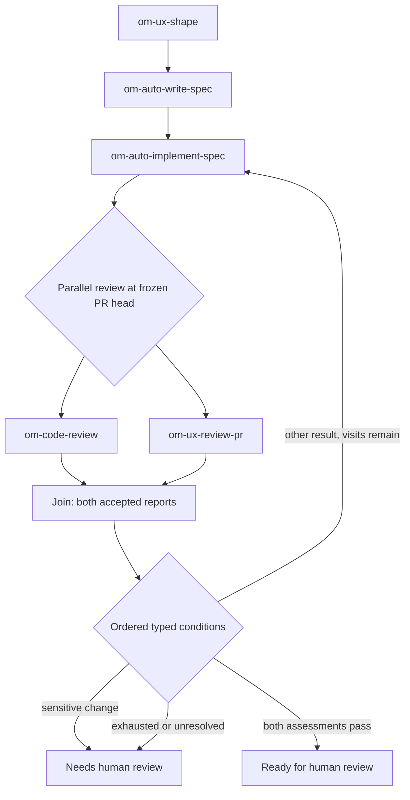

# Decision workflow builder for Open Mercato skills

> Status: proposed design and implementation spec · [Issue #12](https://github.com/Igloczek/cezar/issues/12) · Project: `Igloczek/cezar` only · Depends on [#10](https://github.com/Igloczek/cezar/issues/10) and [#11](https://github.com/Igloczek/cezar/issues/11). Implement after their report and routing contracts are settled.

## Summary

Give workflow authors a way to configure and inspect the decision graphs introduced by #11 without hand-editing YAML. Keep today's ordered chain builder and `quick-task` behavior intact. The worked example uses real Open Mercato skills: `om-ux-shape` → `om-auto-write-spec` → `om-auto-implement-spec` → independent `om-code-review` and `om-ux-review-pr` assessments → a joined decision → human review or bounded rework. The editor exposes skill inputs, runner, typed report fields, ordered conditions, worktree scope, parallel selection, join rule, and failure route before save.

Open Mercato skills are Markdown playbooks, **not** Cezar workflow definitions. Their prose, PR comments, and `PR:`/`Spec:` lines are not typed routing data. Every agent node must submit an accepted Cezar-owned report from #10; workflow-declared fields are validated before #11 selects an edge. This example is a proposed Cezar workflow assembled from real skills, not an existing Open Mercato YAML file. The original screenshot suggests the three-panel layout and visible validation. Publishing versions, production statistics, and dry-run results are outside this spec.

## Visual designs

These are proposed screens with illustrative PR IDs and accepted reports. The actual Open Mercato skill names and order are sourced below; the composite and Parallel controls require the engine extension described below. Editable sources: [desktop HTML](https://github.com/Igloczek/cezar/blob/cez/e62871cb/.ai/specs/assets/decision-workflow-builder/open-mercato-flow.html), [desktop CSS](https://github.com/Igloczek/cezar/blob/cez/e62871cb/.ai/specs/assets/decision-workflow-builder/design.css), and [mobile HTML](https://github.com/Igloczek/cezar/blob/cez/e62871cb/.ai/specs/assets/decision-workflow-builder/open-mercato-mobile.html). Desktop images are 1600 × 1160; the mobile image is 430 × 932.

**Full feature flow —** real skills, two independent review branches, a join, ordered decision, bounded rework, and human terminal outcomes.


<details>
<summary>Agent setup, conditions, parallel configuration, recovery, route history, and mobile layout</summary>

**Agent inspector —** the real `om-auto-implement-spec` skill, runner, bound spec inputs, required report fields, and failure/rework policy.


**Composite rule editor —** nested All/Any groups, enum, boolean, numeric comparison, ordered rules, and Otherwise.


**Parallel group inspector —** branch skills, frozen input, separate source worktrees, expected reports, join policy, and failure routes.


**Unresolved join —** one child has a valid report, the other does not; routing stops or takes the configured human route.


**Run route trace —** both child reports and the ordered predicate outcomes explain the bounded rework decision.


**Narrow layout —** the complete route list remains accessible when the selected node's inspector opens as a sheet.


</details>

## Problem and user outcome

Today `packages/web/src/routes/workflows/workflows.tsx` offers an ordered canvas, skill palette, YAML preview/import/export, and an AI-assisted chain planner. `packages/cezar/src/workflows/types.ts` accepts `steps` or `skills`; a check can retry an earlier step through `onFail`. It does not author arbitrary conditional edges. #11 adds an opt-in graph format so Cezar can route from a validated report instead of agent prose. Without an editor, a user must understand node IDs, report paths, predicates, fallback edges, and visit limits in YAML before they can safely use it.

**Primary job:** A developer can create and save a reusable Open Mercato feature workflow with typed report-driven decisions, an explicit fallback, a bounded rework route, and selected independent review branches that may run in parallel. Success means authors can identify the next node, frozen PR head, join policy, and failure destination before saving. A plausible project effect is fewer misconfigured runs; the guardrail is no change to existing chain workflow behavior. The need for a visual graph, as opposed to a structured form, is an assumption to validate with a prototype.

## Dependencies and source of truth

1. **#10 first:** only a validated, persisted report from the Cezar-owned tool is eligible for routing. A transcript marker or displayed tool call is not an accepted report. The UI shows the accepted report's reference and bounded, redacted details only.
2. **#11 second:** the engine owns graph format, predicate operators, field-path validation, runner eligibility, visit bounds, selected-edge persistence, and recovery. The editor serializes that format. #11 explicitly defers a visual graph editor **and parallel fan-out/joins**. Composite rules and Parallel controls require a later engine/contract extension; the UI must not save them as runnable until that extension exists.
3. **Existing chains:** `steps` and `skills` files, their `onFail` behavior, and built-in `quick-task` continue to load and run unchanged. No automatic conversion to the new format.
4. **API contract:** any new request/response shape lives in `packages/contract` with inferred types. Workflow routes stay chained and versioned under `/api/v1`, use middleware validation, and keep project-scoped route parity.

The #10 report schema does not yet define how an author discovers routable `data` fields and their types. Graph agent nodes therefore declare their expected report fields; accepted data is checked against that declaration before routing. The editor must never suggest arbitrary paths as valid merely because they appeared in one sample report. The concrete contract must be reconciled with #10/#11.

## Product decisions

| Decision | Behavior | Reason |
|---|---|---|
| Two editors | **Chain** retains the ordered builder; **Decision workflow** opens the graph builder. | Authors can keep simple workflows simple and avoid an implicit format migration. |
| Explicit routes | Each conditional decision has ordered predicates and one **Otherwise** route. | A visible fallback matches #11's validation requirement and explains what happens when no predicate matches. |
| Bounded backward routes | An edge to an earlier node displays the per-node visit limit and its exhaustion destination. | A loop cannot be mistaken for an unlimited retry. |
| Save, no publish | **Save workflow** writes the file after server validation; overwrite requires confirmation. | Matches current file-backed workflow semantics. |
| Inspect real runs | **View route** shows persisted decisions and report references. | Provides evidence without simulated success counts. |
| No new AI in authoring | Keep the existing chain planner scoped to chains. Routing uses deterministic predicates. | A generated graph would require a separate quality bar and explicit review. |
| Parallel only when independent | The example runs `om-code-review` and `om-ux-review-pr` on the same frozen PR head in separate worktrees, then waits for both reports. | They can assess independently; `om-auto-qa-pr` is excluded because it has a review-first gate, and `om-auto-review-pr` can autofix the PR while another reader reviews it. |

## Actual skill references and worked flow

The sample is grounded in the public [`om-ux-shape`](https://github.com/open-mercato/skills/blob/main/skills/om-ux-shape/SKILL.md), [`om-auto-write-spec`](https://github.com/open-mercato/skills/blob/main/skills/om-auto-write-spec/SKILL.md), [`om-auto-implement-spec`](https://github.com/open-mercato/skills/blob/main/skills/om-auto-implement-spec/SKILL.md), [`om-code-review`](https://github.com/open-mercato/skills/blob/main/skills/om-code-review/SKILL.md), and [`om-ux-review-pr`](https://github.com/open-mercato/skills/blob/main/skills/om-ux-review-pr/SKILL.md) definitions. `om-auto-write-spec` opens a spec PR, and `om-auto-implement-spec` opens or resumes an implementation PR and performs its own review/UI verification. The final two parallel nodes are **extra independent assessments**, so this fork is opt-in rather than a default cost for every feature. [`om-auto-qa-pr`](https://github.com/open-mercato/skills/blob/main/skills/om-auto-qa-pr/SKILL.md) runs after review by its own contract and must not be selected as a simultaneous peer of code review.



Every skill node has a Cezar report contract in addition to its skill instructions. A PR number, spec path, verdict, finding count, or risk field in the report is an **agent claim** until a check or human verifies it. The two reviewer nodes must assess the same immutable `headSha`; their child runs never merge changes back into the parent automatically.

### Full proposed YAML

This is a **target configuration**, not syntax accepted by today's loader. `cezar.graph/v2` and exact key names must be reconciled with #11 and the later composite/fork contracts. The editor should generate the YAML and reject unsupported node kinds at save/start.

```yaml
format: cezar.graph/v2 # proposed extension after #11
name: open-mercato-feature-flow
start: shape
limits: { maxTransitions: 24, maxParallelChildren: 2 }
nodes:
  shape:
    kind: agent
    skill: om-ux-shape
    runner: codex
    prompt: "Shape {{task}}; submit the declared Cezar report."
    reportFields:
      risk: { type: enum, values: [low, medium, high], required: true }
      uiImpact: { type: enum, values: [none, low, medium, high], required: true }
    next: writeSpec
  writeSpec:
    kind: agent
    skill: om-auto-write-spec
    prompt: "Write the spec for {{task}} in the selected repository; report its PR and path."
    reportFields:
      specPath: { type: string, required: true }
      specPr: { type: integer, required: true }
    next: implement
  implement:
    kind: agent
    skill: om-auto-implement-spec
    prompt: "Implement the accepted spec; report the implementation PR and exact head."
    maxVisits: 2
    reportFields:
      prNumber: { type: integer, required: true }
      headSha: { type: git_sha, required: true }
      touchesAuth: { type: boolean, required: true }
      touchesMoney: { type: boolean, required: true }
    next: reviewFork
  reviewFork:
    kind: fork # requires a post-#11 engine extension
    snapshot: { from: implement.data.headSha, verifyCurrentPrHead: true }
    branches:
      code: { start: codeReview, scope: source_read_only }
      ux: { start: uxReview, scope: source_read_only, externalActions: [pr_comment] }
    join: reviewJoin
  codeReview:
    kind: agent
    skill: om-code-review
    prompt: "Review the frozen implementation head; submit a Cezar report."
    reportFields:
      verdict: { type: enum, values: [approve, changes], required: true }
      reviewedHead: { type: git_sha, required: true }
    next: reviewJoin
  uxReview:
    kind: agent
    skill: om-ux-review-pr
    prompt: "Walk the UI at the frozen implementation head; submit a Cezar report."
    reportFields:
      blockingFindings: { type: integer, min: 0, required: true }
      screensReviewed: { type: integer, min: 0, required: true }
      reviewedHead: { type: git_sha, required: true }
    next: reviewJoin
  reviewJoin:
    kind: join
    mode: all # wait for both; no first-winner cancellation
    requireAcceptedReports: true
    onUnresolved: needsHuman
    onStaleHead: needsHuman
    next: gate
  gate:
    kind: decision
    rules: # first matching rule wins
      - label: Sensitive change
        when:
          all:
            - { field: shape.data.risk, op: in, value: [high] }
            - any:
                - { field: implement.data.touchesAuth, op: eq, value: true }
                - { field: implement.data.touchesMoney, op: eq, value: true }
        next: needsHuman
      - label: Both assessments pass
        when:
          all:
            - { field: codeReview.data.verdict, op: eq, value: approve }
            - { field: uxReview.data.blockingFindings, op: eq, value: 0 }
            - { field: uxReview.data.screensReviewed, op: gte, value: 1 }
        next: readyForHuman
      - label: Rework while visits remain
        when: { field: implement.visits, op: lt, value: 2 }
        next: implement
    otherwise: needsHuman
  readyForHuman: { kind: end, outcome: review }
  needsHuman: { kind: end, outcome: blocked }
```

The named outcomes and bounds above are design proposals. `specPr`/`prNumber` are scoped to the selected repository; `headSha` must resolve to that PR before the fork. The Cezar-owned report tool, not transcript scraping or `cez task report`, supplies routing fields. `source_read_only` prevents a child's source changes from becoming the parent's result; it does not imply the skill has no outside effects. `om-ux-review-pr` may post a PR comment, so the branch displays that action before launch.

### Conditions beyond a boolean

The #11 core handles a small declarative predicate set. The **later extension** adds typed numeric comparisons and nested **All** / **Any** groups (proposed cap: depth 3 and 12 leaves per decision). Field choices are restricted to `report.outcome`, declared `report.data` fields, validated check results, and persisted visit counts. The operator menu follows the type: enum/string **is**, **is not**, **is one of**, **is present**; number **=**, **≠**, **>**, **≥**, **<**, **≤**; boolean **is true/false**, **is present**. No regex, JavaScript, arbitrary JSONPath, secret field, free-form expression, or LLM-chosen edge.

Rules run in their visible order and the first match wins; **Otherwise** is mandatory. A required field missing from an accepted report is a protocol failure that stops unresolved. An optional absent field does not satisfy a comparison, including **is not**; only presence can match absence explicitly. **All** and **Any** retain an `unknown` result for absent optional data so a negation cannot turn missing information into success. The UI warns about possible overlapping rules; the engine records each evaluated predicate and selected edge. Server validation rejects undeclared paths, type mismatch, over-deep groups, missing targets, and unsafe operators.

### Parallel selection and join semantics

The author adds **Parallel group**, chooses two or more branch skills, and sets each **Runner**, **Input**, **Frozen repository/ref**, **Source worktree scope**, **External actions**, and **Expected report fields**. The group inspector offers **Run these branches together**, **Wait for all**, **Maximum concurrent children**, **When a branch cannot finish**, and **Join destination**. Initial join mode is **Wait for all**; first-success/race joins are deferred because sibling cancellation and side effects require a separate policy. Copy: **Each branch starts from the same committed PR head in its own worktree. Changes are never merged automatically.** A write-capable skill cannot be labeled source-read-only; parallel writers require a later disjoint-scope and merge policy. A source-read-only child may still post a PR comment when the author explicitly allows that external action.

The fork records parent run, frozen commit, branch IDs, child run IDs, accepted report references, admission/budget allocation, and join state before launching children. Existing task dispatch supplies separate child worktrees, a four-in-flight cap, and parent summaries, but `cez task report` is distinct from #10's accepted in-task report. A join routes only from valid #10 reports for the correct child run/step/attempt. It persists one idempotent result after every required child settles. Workspace `maxParallel`, dispatch caps, and carved-out budgets still apply; extra children queue visibly. A parked parent releases its execution slot and wakes on child settlement or recovery. Restart cannot duplicate a child or skip a join; cancel and human review remain authoritative.

`all_completed` requires every child to settle successfully with a valid report at the same frozen head. Missing/invalid report, timeout, unavailable runner, or canceled child gives `unresolved`; a changed PR head gives `stale`; a failed child gives `failed`. Each takes an explicit configured edge or stops with a useful reason. A valid sibling report never hides another branch's failure. The run UI shows every child as **Queued**, **Running**, **Reported**, **Failed**, **Canceled**, **Stale**, or **Unresolved**, linked to its child run. No implicit sibling cancellation or automatic branch merge.

## Screens and interaction

### 1. Workflow library (`/p/:projectId/workflows`)

- Heading **Workflows**; actions **New workflow** and **Import YAML**; search field **Search workflows**.
- Each entry shows name, description, **Chain** or **Decision**, **Built in** where applicable, and **Edit**. The built-in `quick-task` cannot be deleted.
- Empty state: **No saved workflows yet. Create a workflow to reuse a sequence of agent steps.** Action: **New workflow**.
- Loading: **Loading workflows…**. Load error: **Could not load workflows.** Action: **Retry**; show the server detail below without losing local edits.
- An invalid workflow file remains visible as **Could not load** with its path and parser reason, consistent with the existing workflow catalog's `issues` response; it must not disappear from the library.

### 2. New workflow choice

**New workflow** opens two choices:

- **Chain** — **Run agent and check steps in order.** Opens the current builder.
- **Decision workflow** — **Choose the next step from a structured report or check result.** Opens the new builder.

Import detects the server-parsed format and opens the matching editor. An existing chain is never silently converted. If a user intentionally requests conversion later, that is separate work.

### 3. Decision workflow editor (`/p/:projectId/workflows/:name` for saved workflows)

At desktop width, use three regions: a left step palette, a central connected flow, and a right inspector. At narrow widths, the palette and inspector open as labeled sheets; the flow has an always-available **Route list** that presents the same connections in reading order. Reuse the existing `Button`, `Input`, `Textarea`, `AlertDialog`, and loading/error primitives. Preserve the established project scope and route patterns.

**Header:** editable workflow name, **Unsaved changes** or **Saved**, **Export YAML**, **Save workflow**. An unsaved navigation attempt asks **Discard unsaved changes?** with **Keep editing** and **Discard changes**.

**Palette:** searchable **Add a step** list with **Agent step**, **Check**, **Decision**, **End**, and, only when the engine supports it, **Parallel group** and **Join**. Installed Open Mercato skills appear by their real names in the Agent step picker. An explicit **Add next step** action on each node supports keyboard and touch use; pointer dragging is optional.

**Canvas:** each node card shows a type, name, concise configuration summary, and an error count when invalid. Each connection shows its condition or **Otherwise**; backward routes show **Repeat · at most N visits**. Selection opens the relevant inspector. The selected route is also described in text, so color and line shape never carry meaning alone. Canvas zoom/pan must retain keyboard access to every node and route. A simple ordered **Route list** is required even if a visual canvas library is used.

**Agent inspector:** **Step name**, **Skill**, **Runner**, **Instructions**, **Input bindings**, and a **Report fields** table with field name, type, required/optional, and allowed enum values. **Report required** is fixed for graph agent nodes, with the text **This step must submit a structured report before Cezar chooses a route.** Unsupported runners are disabled with **This runner cannot submit workflow reports. Choose a supported runner.** An absent selected skill shows **This skill is not installed here. Choose another skill or install it before saving.** The editor cannot infer report fields from a skill's prose.

**Check inspector:** **Step name** and **Command**. Check routing offers only results allowed by the final #11 contract. The UI must not imply that arbitrary command output is a validated report field.

**Decision/route inspector:** ordered rule cards. Each card has **Match all / Match any**, **Add condition**, **Add group**, typed **Report field**, **Operator**, **Value**, and **Next step**, plus a plain-language **Reads as** summary. Start with #11's operators; show numeric and nested-group controls only when the later contract exists. Final row: **Otherwise → [step]**. A route with no fallback is blocking. For a backward route, show **Maximum visits**, **When exhausted**, and the destination. The field picker uses declared reports, not arbitrary paths. No free-form expression editor.

**Parallel group inspector:** **Branches** lists each selected skill, runner, input, frozen PR head, read-only worktree scope, and expected report; **Add branch** adds another. **Join policy: Wait for all** and **Maximum concurrent children** sit below. Explain queued branches and worktree isolation. **When a branch cannot finish** names an explicit route. If the engine lacks fork/join, the control explains **Requires a newer workflow engine** and cannot be saved as runnable.

**End inspector:** **Outcome** with **Complete**, **Needs review**, or **Fail**, only where those outcomes map to #11's actual terminal states. Do not promise a new lifecycle state from UI copy alone.

**Problems to fix:** persistent list of server-authoritative validation errors, each focusing the node or route. Examples: **“Review gate” has no Otherwise route. Add one before saving.**; **The route back to “Implement” needs a visit limit.**; **Code review and UX review must use the same PR head.**; **No terminal path is reachable from “Start”.** A warning that is not blocking must say so explicitly. Do not display invented run counts or a “safe to publish” claim.

**Save:** submit through the versioned workflow route using the #11 graph schema. Validate client-side for timely feedback, then trust the server result. Keep the draft in memory on request failure. Show **Workflow wasn’t saved: [server reason]. Fix the highlighted item and try again.** Existing-file collision retains the current overwrite confirmation; its cancel action leaves the draft intact. After save, show **Saved workflow** and make the file available in the task workflow picker. Saving a changed definition must not mutate a running task's persisted definition; confirm this engine assumption during implementation.

### 4. Run route trace

From a run created with a decision workflow, **View route** opens a read-only ordered trace. For each visit show node name, attempt, accepted report reference or check result, predicates considered, selected edge, and visit count. A parallel group shows its frozen PR head, child run links and statuses, join result, and stale/unresolved reason. A route to a prior node includes the remaining limit or exhaustion reason. Link to existing run details. Redact secrets and cap displayed report data as #10 requires.

Missing or rejected report: **No accepted report was received for this attempt. Routing stopped.** Action **Open run**. A blocked report that has no matching or fallback route shows the recorded unresolved reason. Canceled runs and human review keep their authoritative status. Never reconstruct route decisions from final prose.

## State and recovery requirements

| State | What the user sees | Recovery |
|---|---|---|
| Empty decision draft | **Add an agent step to start this workflow.** | **Add agent step** |
| Partial graph | Node and route errors in **Problems to fix**; **Save workflow** disabled until valid. | Focus each error and edit it. |
| Unknown report field or type | **This report field is not available for routing. Choose a validated field.** | Choose a field or revise the reporting contract. |
| Unsupported runner | **This runner cannot submit workflow reports. Choose a supported runner.** | Select a supported runner. |
| Save in progress | **Saving…** on the action; preserve the draft. | Wait or retry after failure. |
| Save conflict | Existing workflow confirmation names the file and says overwrite has no undo. | **Keep the file** or **Overwrite**. |
| Load or import error | Exact file/parse reason; no partial replacement of the current draft. | Correct YAML and retry; return to the draft. |
| No accepted report in a run | **No accepted report was received for this attempt. Routing stopped.** | **Open run** to inspect and continue through existing controls. |
| Absent optional report field | **This field was absent; its comparison did not match.** | Add an explicit presence rule or follow Otherwise. |
| Parallel capacity full | **2 review branches queued for an available slot.** | Inspect queue; no hidden extra process is started. |
| Child failed or never reported | **Code review stopped before submitting a report. The join did not continue.** | **Open child run**; follow an explicit unresolved route or stop. |
| PR changes after fork | **The PR changed while reviews were running. Review the new head before continuing.** | Rerun both branches on a new frozen head. |
| Loop limit exhausted | **The rework limit was reached. This workflow needs human review.** | Open run and route to the configured human/blocked terminal. |

Keyboard users must be able to add, select, reorder where meaningful, connect, edit, and remove nodes without drag gestures. Visible focus, readable route labels, and non-color status cues are required. Confirm accessible graph interaction with a prototype before choosing a canvas library.

## Engineering boundaries

- Extend the workflow definition/contract only with the final #11 versioned graph format; do not widen the legacy schema to treat graph data as an ordered chain. `packages/cezar/src/workflows/types.ts`, `packages/contract/src/workflows.ts`, loader, save/parse routes, run persistence, and client need the same discriminant and bounds.
- Keep workflow response parity and typed-body coverage. A project-scoped route needs its boot alias. Route validation belongs in middleware. Catalog load failures remain nonfatal.
- The current builder's eight-step cap applies to current chains. Graph limits must come from #11's documented node and visit bounds; do not reuse eight without a reason.
- Preserve file-based workflows under `.ai/cezar/workflows/`; no required config, background process, network request, or environment variable.
- Route-history UI reads persisted #11 transitions. It must show exactly what the engine recorded after crash recovery; no client-side predicate replay.
- Composite predicates and fork/join require a **separate engine and contract extension after #11**. The UI must gate these node kinds by actual engine capability at load, save, and start. The YAML example above cannot run on #11 alone.
- A fork uses durable child identities and #10 report references. Existing `cez task report` summaries do not satisfy a join. Children fork the same committed ref; no parallel edit to one worktree and no automatic merge.
- Do not change `CEZ:DONE`, `CEZ:ASK`, `CEZ:MONITORING`, or `onFail` behavior for legacy workflows. In the new graph format, final-report completion follows #11.

## Delivery and acceptance

1. With #10 and #11 implemented, a user can create a decision workflow containing an agent report condition, an **Otherwise** path, a bounded backward route, and a reachable terminal node through the UI; saving writes valid graph YAML and the workflow appears in the task picker.
2. Given invalid edges, unknown targets or fields, missing fallback, unbounded cycle, unsupported runner, or unreachable terminal path, the UI identifies the offending control, and server save/start validation rejects the graph without discarding the draft.
3. Given a legacy `steps` or `skills` workflow, opening, editing, importing, exporting, saving, and running it retain current behavior. `quick-task` is unchanged. No automatic conversion occurs.
4. Given a completed graph run, **View route** shows the persisted accepted report reference, conditions considered, chosen edge, visit counts, and stop reason. A refresh or restart yields the same trace.
5. Given missing or invalid report and exhausted nudge attempts, the trace shows an unresolved stop, never a success edge. Cancel and human review still take precedence.
6. Keyboard and touch users can complete the example graph without pointer drag. The route list exposes all conditions and limits in text.
7. Once the later extension exists, a user can select `om-code-review` and `om-ux-review-pr` as read-only parallel branches, configure **Wait for all**, and author an **All** group containing an **Any** group and numeric comparison. Saving rejects unsupported combinations; a run records both accepted child reports and one durable join result.
8. Given either child missing a report, failing, or reviewing a stale PR head, the join never takes its success edge. A restart before or after child launch or edge selection cannot duplicate work or change the chosen result.

**Delivery sequence:** (A) #11-compatible simple editor and trace; (B) bounded composite predicate AST plus field declarations; (C) durable fork/join execution over isolated children; (D) parallel authoring and run-history UI. Each step must leave legacy chains working. The later UI is enabled only with its matching engine support. The implementation agent should test the example flow end to end with mock agents that submit real accepted reports, including both child settlement orders, an unresolved child, a stale head, capacity queueing, and crash recovery.

Verification: meaningful route/UI tests for save validation, branch/fallback/loop authoring, import of both formats, unsaved-change recovery, unsupported runner, and persisted run trace; server contract parity, route parity, typed bodies, and legacy-workflow regression tests. Run the repository's required typecheck, test, build, and package checks for the implementation PR.

## Decision-changing test and open dependency

Prototype one branch plus one bounded retry with the canvas and route list. Ask developers to create it and explain the fallback and maximum visits without coaching. If they cannot, simplify the inspector and route list before building the canvas. This is a proposed test, not completed research.

The final #10/#11 contracts must settle discoverable report-field paths/types, terminal outcome names, graph size limits, and the run-history response before UI implementation. The editor must follow those contracts rather than define a second routing model.
