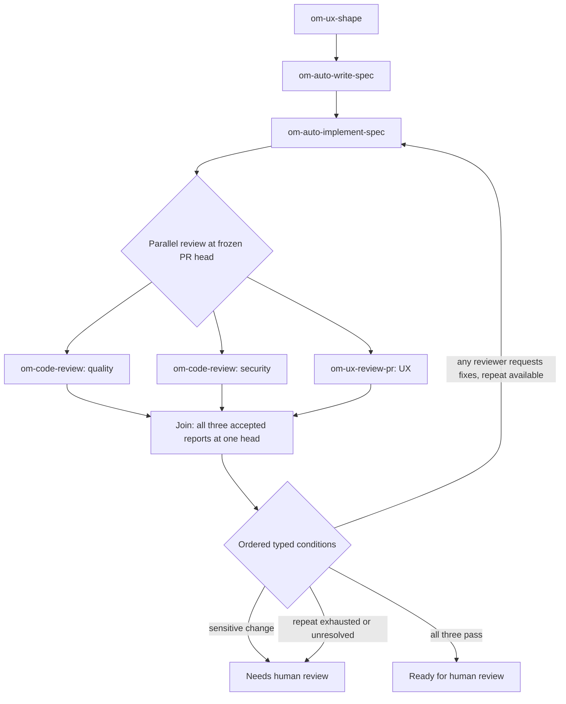

# Unified workflow builder for Open Mercato skills

> Status: proposed design and implementation spec · [Issue #12](https://github.com/Igloczek/cezar/issues/12) · Project: `Igloczek/cezar` only · Depends on [#10](https://github.com/Igloczek/cezar/issues/10) and [#11](https://github.com/Igloczek/cezar/issues/11). Implement after their report and routing contracts are settled.

## Summary

Give authors **one workflow editor** for a simple sequence, conditional route, loop, or parallel group. A sequence is the simplest graph: each step points to the next. The worked example uses real Open Mercato skills: `om-ux-shape` → `om-auto-write-spec` → `om-auto-implement-spec` → a fork into three reviewer steps → a wait-for-all join → a decision that either proceeds to human review or **repeats implementation once**. The editor makes that return path as easy to add as any other route, while showing its limit and fallback on the canvas.

Open Mercato skills are Markdown playbooks, **not** Cezar workflow definitions. Their prose, PR comments, and `PR:`/`Spec:` lines are not typed routing data. Every agent node must submit an accepted Cezar-owned report from #10; workflow-declared fields are validated before #11 selects an edge. This example is a proposed Cezar workflow assembled from real skills, not an existing Open Mercato YAML file. The original screenshot suggests the three-panel layout and visible validation. Publishing versions, production statistics, and dry-run results are outside this spec.

## Visual designs

The screens below cover the whole authoring and run flow. They are design proposals with illustrative PR IDs and reports; they do not imply the graph or parallel engine already exists. Editable sources: [library, agent setup, and validation](https://github.com/Igloczek/cezar/blob/cez/e62871cb/.ai/specs/assets/decision-workflow-builder/workflow-screens.html), [editor canvas, selected routes, and route trace](https://github.com/Igloczek/cezar/blob/cez/e62871cb/.ai/specs/assets/decision-workflow-builder/open-mercato-flow.html), [reviewer waiting state](https://github.com/Igloczek/cezar/blob/cez/e62871cb/.ai/specs/assets/decision-workflow-builder/parallel-review.html), [mobile route list](https://github.com/Igloczek/cezar/blob/cez/e62871cb/.ai/specs/assets/decision-workflow-builder/open-mercato-mobile.html), and [shared canvas CSS](https://github.com/Igloczek/cezar/blob/cez/e62871cb/.ai/specs/assets/decision-workflow-builder/design.css). Desktop images are 1600 px wide; mobile is 430 px wide.

### 1. Create one workflow

The library has one **New workflow** action. The new workflow starts as a simple sequence; the same editor adds decisions, loops, and parallel branches when needed. Existing workflows and `quick-task` remain visible.


### 2. See the complete workflow

The canvas shows the actual Open Mercato skills, a clearly directed return arrow for rework, three reviewer branches, their join, and terminal outcomes in one view.


### 3. Configure an agent step

The `om-auto-implement-spec` form binds inputs, runner, instructions, required typed report fields, next step, and failure behavior.


### 4. Make a decision route loop back

The user selects the orange return route **on the same editor canvas**. Its inspector combines an **Any** condition across reviewer reports with **Repeat a previous step**, target, maximum repeats, and what happens at the limit. The initial implementation plus one repeat means two visits.


### 5. Edit a nested condition on the same canvas

Selecting the **Sensitive change** route keeps the full flow visible. Its inspector edits an **All** group containing the risk field and a nested **Any** group for authentication or money changes. Field, operator, value, destination, **Add condition**, and **Add group** are shown in place; the **Reads as** summary explains the resulting rule.


### 6. Add multiple parallel reviewers

Selecting the parallel group **on that same canvas** shows **Add reviewer**, separate skills and instructions, one frozen PR head, and the wait-for-all join. The same skill can be used for distinct reviews.


### 7. Wait for every reviewer

Two accepted reports do not advance the run while the third child is running. The join and decision display their pending state.


### 8. Repair an invalid draft

A separate validation screen focuses an unknown report field, a repeat route without a limit, and a missing At limit destination. The draft is retained while Save is blocked.


### 9. Inspect the route taken

The run trace shows the accepted reports, joined result, evaluated rules, and bounded rework route. This is read-only evidence from the persisted run.


### 10. Use the route list on a narrow screen

The mobile view exposes the sequence, each reviewer branch, Add reviewer, join, decision, and repeat route without requiring drag gestures.


## Problem and user outcome

Today `packages/web/src/routes/workflows/workflows.tsx` offers an ordered canvas, skill palette, YAML preview/import/export, and an AI-assisted chain planner. `packages/cezar/src/workflows/types.ts` accepts `steps` or `skills`; a check can retry an earlier step through `onFail`. It does not author arbitrary conditional edges. #11 adds graph routing from validated reports. Authors should not have to choose a second workflow type or learn YAML to use conditions, loops, and parallel reviewers.

**Primary job:** A developer can start with a sequence and add a report-driven decision, a **visible bounded return route**, and independent reviewers in the same workflow. Success means authors can point to the return target, repeat limit, at-limit destination, every reviewer branch, wait-for-all join, and next decision before saving. A plausible project effect is fewer misconfigured runs; the guardrail is unchanged execution of existing workflow files. The need for a visual canvas, as opposed to a route list alone, is an assumption to validate with a prototype.

## Dependencies and source of truth

1. **#10 first:** only a validated, persisted report from the Cezar-owned tool is eligible for routing. A transcript marker or displayed tool call is not an accepted report. The UI shows the accepted report's reference and bounded, redacted details only.
2. **#11 second:** the engine owns graph format, predicate operators, field-path validation, runner eligibility, visit bounds, selected-edge persistence, and recovery. The editor serializes that format. #11 explicitly defers a visual graph editor **and parallel fan-out/joins**. A direct route-level repeat limit, composite rules, and Parallel controls require the matching later engine/contract support; the UI must not save them as runnable before it exists.
3. **Existing files:** `steps` and `skills` files, their `onFail` behavior, and built-in `quick-task` continue to load and run unchanged. The one editor renders them as a simple sequence in memory. New workflows save in the unified graph format; an existing file is rewritten only when the user saves an edit, with equivalent route behavior verified before that save.
4. **API contract:** any new request/response shape lives in `packages/contract` with inferred types. Workflow routes stay chained and versioned under `/api/v1`, use middleware validation, and keep project-scoped route parity.

The #10 report schema does not yet define how an author discovers routable `data` fields and their types. Graph agent nodes therefore declare their expected report fields; accepted data is checked against that declaration before routing. The editor must never suggest arbitrary paths as valid merely because they appeared in one sample report. The concrete contract must be reconciled with #10/#11.

## Product decisions

| Decision | Behavior | Reason |
|---|---|---|
| One editor | **New workflow** opens a sequence in the same canvas that can add checks, decisions, loops, and parallel groups. Existing files open there too. | The user has one workflow concept and one place to extend it. |
| Explicit routes | Each conditional decision has ordered predicates and one **Otherwise** route. | A visible fallback matches #11's validation requirement and explains what happens when no predicate matches. |
| First-class repeat route | **Repeat a previous step** draws a directed return arrow and requires **Return to**, **Maximum repeats**, and **At limit**. | The main reason to add decision gates is easy, safe rework without hand-editing a cycle. |
| Save, no publish | **Save workflow** writes the file after server validation; overwrite requires confirmation. | Matches current file-backed workflow semantics. |
| Inspect real runs | **View route** shows persisted decisions and report references. | Provides evidence without simulated success counts. |
| No new AI in authoring | The existing planner can propose an ordered starting sequence within the unified editor; routing uses deterministic predicates. | A generated graph would require a separate quality bar and explicit review. |
| Configurable fan-out and wait-for-all join | The author adds reviewer branches to one fork. The example launches quality and security instances of `om-code-review` plus `om-ux-review-pr` from the same frozen PR head, then waits for **all three** reports before deciding. | A reviewer that finishes first cannot advance the workflow. More reviewers use the same pattern, subject to the workspace and dispatch caps. `om-auto-qa-pr` is excluded because it has a review-first gate, and `om-auto-review-pr` can autofix the PR while another reader reviews it. |

## Actual skill references and worked flow

The sample is grounded in the public [`om-ux-shape`](https://github.com/open-mercato/skills/blob/main/skills/om-ux-shape/SKILL.md), [`om-auto-write-spec`](https://github.com/open-mercato/skills/blob/main/skills/om-auto-write-spec/SKILL.md), [`om-auto-implement-spec`](https://github.com/open-mercato/skills/blob/main/skills/om-auto-implement-spec/SKILL.md), [`om-code-review`](https://github.com/open-mercato/skills/blob/main/skills/om-code-review/SKILL.md), and [`om-ux-review-pr`](https://github.com/open-mercato/skills/blob/main/skills/om-ux-review-pr/SKILL.md) definitions. `om-auto-write-spec` opens a spec PR, and `om-auto-implement-spec` opens or resumes an implementation PR and performs its own review/UI verification. The fork contains **three independently configured reviewer steps**: two invocations of `om-code-review` with distinct instructions (general quality and security/privacy) and one `om-ux-review-pr`. These are extra assessments, so the fork is opt-in rather than a default cost for every feature. [`om-auto-qa-pr`](https://github.com/open-mercato/skills/blob/main/skills/om-auto-qa-pr/SKILL.md) runs after review by its own contract and must not be selected as a simultaneous peer of code review.



Every skill node has a Cezar report contract in addition to its skill instructions. A PR number, spec path, verdict, finding count, or risk field in the report is an **agent claim** until a check or human verifies it. The three reviewer nodes must assess the same immutable `headSha`; their child runs never merge changes back into the parent automatically.

### Full proposed YAML

This is a **target configuration**, not syntax accepted by today's loader. `cezar.graph/v2`, the route-level `repeat` block, and exact key names must be reconciled with #11 and the later composite/fork contracts. The editor should generate the YAML and reject unsupported node kinds at save/start. A simple sequence uses the same format with unconditional `next` edges.

```yaml
format: cezar.graph/v2 # proposed extension after #11
name: open-mercato-feature-flow
start: shape
limits: { maxTransitions: 24, maxParallelChildren: 3 }
nodes:
  shape:
    kind: agent
    skill: om-ux-shape
    runner: codex
    prompt: "Shape {{task}}; submit the declared Cezar report."
    reportFields:
      risk: { type: enum, values: [low, medium, high], required: true }
      uiImpact: { type: enum, values: [none, low, medium, high], required: true }
    next: writeSpec
  writeSpec:
    kind: agent
    skill: om-auto-write-spec
    prompt: "Write the spec for {{task}} in the selected repository; report its PR and path."
    reportFields:
      specPath: { type: string, required: true }
      specPr: { type: integer, required: true }
    next: implement
  implement:
    kind: agent
    skill: om-auto-implement-spec
    prompt: "Implement the accepted spec; report the implementation PR and exact head."
    reportFields:
      prNumber: { type: integer, required: true }
      headSha: { type: git_sha, required: true }
      touchesAuth: { type: boolean, required: true }
      touchesMoney: { type: boolean, required: true }
    next: reviewFork
  reviewFork:
    kind: fork # requires a post-#11 engine extension
    snapshot: { from: implement.data.headSha, verifyCurrentPrHead: true }
    branches:
      quality: { start: qualityReview, scope: source_read_only }
      security: { start: securityReview, scope: source_read_only }
      ux: { start: uxReview, scope: source_read_only, externalActions: [pr_comment] }
    join: reviewJoin
  qualityReview:
    kind: agent
    skill: om-code-review
    runner: codex
    prompt: "Review architecture and code quality at the frozen head; report a verdict."
    reportFields:
      verdict: { type: enum, values: [approve, changes], required: true }
      reviewedHead: { type: git_sha, required: true }
    next: reviewJoin
  securityReview:
    kind: agent
    skill: om-code-review
    runner: codex
    prompt: "Review security and privacy risks at the frozen head; report a verdict."
    reportFields:
      verdict: { type: enum, values: [approve, changes], required: true }
      reviewedHead: { type: git_sha, required: true }
    next: reviewJoin
  uxReview:
    kind: agent
    skill: om-ux-review-pr
    runner: codex
    prompt: "Walk the UI at the frozen implementation head; submit a Cezar report."
    reportFields:
      blockingFindings: { type: integer, min: 0, required: true }
      screensReviewed: { type: integer, min: 0, required: true }
      reviewedHead: { type: git_sha, required: true }
    next: reviewJoin
  reviewJoin:
    kind: join
    mode: all # wait for all three; no first-winner cancellation
    requireAcceptedReports: true
    requireSameHead: true
    onUnresolved: needsHuman
    onFailed: needsHuman
    onStaleHead: needsHuman
    next: gate
  gate:
    kind: decision
    rules: # first matching rule wins
      - label: Sensitive change
        when:
          all:
            - { field: shape.data.risk, op: in, value: [high] }
            - any:
                - { field: implement.data.touchesAuth, op: eq, value: true }
                - { field: implement.data.touchesMoney, op: eq, value: true }
        next: needsHuman
      - label: Any reviewer requests fixes
        when:
          any:
            - { field: qualityReview.data.verdict, op: eq, value: changes }
            - { field: securityReview.data.verdict, op: eq, value: changes }
            - { field: uxReview.data.blockingFindings, op: gt, value: 0 }
        next: implement
        repeat: { maxRepeats: 1, onLimit: needsHuman }
      - label: All three assessments pass
        when:
          all:
            - { field: qualityReview.data.verdict, op: eq, value: approve }
            - { field: securityReview.data.verdict, op: eq, value: approve }
            - { field: uxReview.data.blockingFindings, op: eq, value: 0 }
            - { field: uxReview.data.screensReviewed, op: gte, value: 1 }
        next: readyForHuman
    otherwise: needsHuman
  readyForHuman: { kind: end, outcome: review }
  needsHuman: { kind: end, outcome: blocked }
```

The named outcomes and bounds above are design proposals. `repeat.maxRepeats: 1` means one return along that route after the initial implementation, so `om-auto-implement-spec` may run twice. The route counter and limit result must persist across restarts; the global `maxTransitions` remains a second safety bound. `specPr`/`prNumber` are scoped to the selected repository; `headSha` must resolve to that PR before the fork. The Cezar-owned report tool, not transcript scraping or `cez task report`, supplies routing fields. `source_read_only` prevents a child's source changes from becoming the parent's result; it does not imply the skill has no outside effects. `om-ux-review-pr` may post a PR comment, so the branch displays that action before launch.

### Conditions beyond a boolean

The #11 core handles a small declarative predicate set. The **later extension** adds typed numeric comparisons and nested **All** / **Any** groups (proposed cap: depth 3 and 12 leaves per decision). Field choices are restricted to `report.outcome`, declared `report.data` fields, validated check results, and persisted visit counts. The operator menu follows the type: enum/string **is**, **is not**, **is one of**, **is present**; number **=**, **≠**, **>**, **≥**, **<**, **≤**; boolean **is true/false**, **is present**. No regex, JavaScript, arbitrary JSONPath, secret field, free-form expression, or LLM-chosen edge.

Rules run in their visible order and the first match wins; **Otherwise** is mandatory. A required field missing from an accepted report is a protocol failure that stops unresolved. An optional absent field does not satisfy a comparison, including **is not**; only presence can match absence explicitly. **All** and **Any** retain an `unknown` result for absent optional data so a negation cannot turn missing information into success. The UI warns about possible overlapping rules; the engine records each evaluated predicate and selected edge. Server validation rejects undeclared paths, type mismatch, over-deep groups, missing targets, and unsafe operators.

### Loops are a direct route action

From a decision, the author selects **Add route** → **Repeat a previous step**. The editor shows eligible earlier steps in **Return to**; choosing one draws a directed return connector immediately. The inspector requires **Maximum repeats** and **At limit** before Save. In the example, **Return to: om-auto-implement-spec**, **Maximum repeats: 1**, and **At limit: Needs human review** mean one rework attempt after the initial implementation. The canvas labels the connector **Repeat implementation · once**, and the route list describes the same path in text. The author can select the line to edit or remove it without hunting through YAML. Keyboard users can create and select it through the route list.

The repeat count belongs to the **selected route**, not to every visit of its target. A loop is taken only when its condition matches and the counter is below the limit; at the limit, it takes the configured destination atomically. Re-entering implementation creates a new visit and, after its PR head changes, a new three-reviewer fork and join at that head. A restart preserves the count and chosen transition. The server rejects an unbounded backward edge, an unreachable limit destination, a loop with no terminal escape, or a route whose return target was deleted. The global transition cap still stops unexpected cycles with an explicit reason. The UI's **Reads as** preview shows first match, repeated match, and exhausted match before Save.

### Parallel selection and join semantics

The author adds **Parallel group**, then **Add reviewer** creates another branch card and connection to the same join. Each branch has a unique author-editable label and stable ID, **Skill**, **Runner**, **Instructions/focus**, **Input**, **Frozen repository/ref**, **Source worktree scope**, **External actions**, and **Expected report fields**. The same skill may appear in more than one branch, as quality and security `om-code-review` do here; reports are keyed by branch ID, not skill name. Removing a branch removes its connection and invalidates rules that still reference its fields; reordering changes display order only, never the wait policy or decision priority. The join shows **3 required reviewer reports** and updates its count when the author adds or removes a branch. With fewer than two branches, save is blocked until the group is repaired or removed.

The group inspector offers **Launch selected branches together**, **Wait for all**, **Maximum concurrent children**, **When a branch cannot finish**, and **Join destination**. Initial join mode is **Wait for all**; first-success/race joins are deferred because sibling cancellation and side effects require a separate policy. Copy: **Each branch starts from the same committed PR head in its own worktree. Changes are never merged automatically.** A write-capable skill cannot be labeled source-read-only; parallel writers require a later disjoint-scope and merge policy. A source-read-only child may still post a PR comment when the author explicitly allows that external action.

The fork freezes the **required branch set** for that visit and records parent run, frozen commit, branch IDs, child run IDs, accepted report references, admission/budget allocation, and join state before launching children. Existing task dispatch supplies separate child worktrees, a four-in-flight cap, and parent summaries, but `cez task report` is distinct from #10's accepted in-task report. A join routes only from valid #10 reports for the correct child run/step/attempt. It persists one idempotent result **only after every required child has reached a terminal state**. A child requesting changes never short-circuits another running reviewer. Workspace `maxParallel`, dispatch caps, and carved-out budgets still apply; extra children queue visibly and still count as pending. A parked parent releases its execution slot and wakes on child settlement or recovery. Restart cannot duplicate a child or skip a join; cancel and human review remain authoritative.

`all_completed` requires every child to settle successfully with a valid report at the same frozen head. Missing/invalid report, timeout, unavailable runner, or canceled child gives `unresolved`; a changed PR head gives `stale`; a failed child gives `failed`. The join waits for every branch to settle, then takes an explicit configured failure edge or stops with a useful reason; a timeout must turn a stuck child into a terminal unresolved result. A valid sibling report never hides another branch's failure. The run UI shows **0/3, 1/3, 2/3, 3/3 accepted reports**, every child as **Queued**, **Running**, **Reported**, **Failed**, **Canceled**, **Stale**, or **Unresolved**, and a link to each child run. **The decision remains locked at 2/3**. After 3/3, it evaluates all reports: any quality/security `changes` verdict or UX blocker enters bounded rework; all three passing enters human review; unmatched or exhausted outcomes enter Needs human review. No implicit sibling cancellation or automatic branch merge.

## Screens and interaction

### 1. Workflow library (`/p/:projectId/workflows`)

- Heading **Workflows**; actions **New workflow** and **Import YAML**; search field **Search workflows**.
- Each entry shows name, description, a short step summary, **Built in** where applicable, and **Edit**. There is no workflow type badge or type filter. The built-in `quick-task` cannot be deleted.
- Empty state: **No saved workflows yet. Create a workflow to reuse a sequence of agent steps.** Action: **New workflow**.
- Loading: **Loading workflows…**. Load error: **Could not load workflows.** Action: **Retry**; show the server detail below without losing local edits.
- An invalid workflow file remains visible as **Could not load** with its path and parser reason, consistent with the existing workflow catalog's `issues` response; it must not disappear from the library.

### 2. New workflow dialog

**New workflow** asks for **Workflow name** and opens the single editor with an empty sequence and **Add agent step**. Copy: **Start with one agent step. Add checks, decisions, loops, or parallel reviewers as needed.** There is no type selection.

Import parses both the existing `steps`/`skills` files and the unified graph format into the same editor. A legacy file is represented as a sequence with unconditional Next routes. The editor preserves its current execution when opened; saving an edit serializes it to the unified format only after server validation confirms the behavior mapping. A read-only open does not rewrite the file. `quick-task` keeps its built-in behavior.

### 3. Workflow editor (`/p/:projectId/workflows/:name` for saved workflows)

At desktop width, use three regions: a left step palette, a central connected flow, and a right inspector. At narrow widths, the palette and inspector open as labeled sheets; the flow has an always-available **Route list** that presents the same connections in reading order. Reuse the existing `Button`, `Input`, `Textarea`, `AlertDialog`, and loading/error primitives. Preserve the established project scope and route patterns.

**Header:** editable workflow name, **Unsaved changes** or **Saved**, **Export YAML**, **Save workflow**. An unsaved navigation attempt asks **Discard unsaved changes?** with **Keep editing** and **Discard changes**.

**Palette:** searchable **Add a step** list with **Agent step**, **Check**, **Decision**, **End**, and, when the engine supports them, **Repeat route**, **Parallel group**, and **Join**. **Repeat route** focuses the selected decision's **Add route → Repeat a previous step** action. Installed Open Mercato skills appear by their real names in the Agent step picker. An explicit **Add next step** action on each node supports keyboard and touch use; pointer dragging is optional.

**Canvas:** each node card shows a type, name, concise configuration summary, and an error count when invalid. Each connection shows its condition or **Otherwise**. A return route has an arrow pointing into its target and a label such as **Repeat implementation · once**. Clicking the line or its route-list entry opens the same inspector. The selected route is also described in text, so color and line shape never carry meaning alone. Canvas zoom/pan must retain keyboard access to every node and route. A simple ordered **Route list** is required even if a visual canvas library is used.

**Agent inspector:** **Step name**, **Skill**, **Runner**, **Instructions**, **Input bindings**, and a **Report fields** table with field name, type, required/optional, and allowed enum values. **Report required** is fixed for graph agent nodes, with the text **This step must submit a structured report before Cezar chooses a route.** Unsupported runners are disabled with **This runner cannot submit workflow reports. Choose a supported runner.** An absent selected skill shows **This skill is not installed here. Choose another skill or install it before saving.** The editor cannot infer report fields from a skill's prose.

**Check inspector:** **Step name** and **Command**. Check routing offers only results allowed by the final #11 contract. The UI must not imply that arbitrary command output is a validated report field.

**Decision/route inspector:** ordered rule cards. Each has **Match all / Match any**, **Add condition**, **Add group**, typed **Report field**, **Operator**, **Value**, and **Next step**, plus a plain-language **Reads as** summary. **Add route → Repeat a previous step** opens **Return to**, **Maximum repeats**, and **At limit** in that same inspector and draws the return arrow as soon as a target is chosen. Start with #11's operators; show numeric and nested-group controls only when the later contract exists. Final row: **Otherwise → [step]**. A route with no fallback is blocking. The field picker uses declared reports, not arbitrary paths. No free-form expression editor.

**Parallel group inspector:** **Reviewer branches** lists each stable branch ID, editable label, skill, instructions/focus, runner, input, frozen PR head, read-only worktree scope, external actions, and expected report. **Add reviewer** adds another lane and join connection; **Remove reviewer** asks for confirmation if a decision references that branch. The header says **All 3 reviewer reports required** and updates as branches change. **Join policy: Wait for all** and **Maximum concurrent children** sit below. Explain queued branches and worktree isolation. **When a branch cannot finish** names an explicit route. If the engine lacks fork/join, the control explains **Requires a newer workflow engine** and cannot be saved as runnable.

**End inspector:** **Outcome** with **Complete**, **Needs review**, or **Fail**, only where those outcomes map to #11's actual terminal states. Do not promise a new lifecycle state from UI copy alone.

**Problems to fix:** persistent list of server-authoritative validation errors, each focusing the node or route. Examples: **“Review gate” has no Otherwise route. Add one before saving.**; **The repeat route to “Implement” needs Maximum repeats and At limit.**; **All reviewer branches must use the same PR head.**; **The decision still references a removed reviewer. Update its rule.**; **No terminal path is reachable from “Start”.** A warning that is not blocking must say so explicitly. Do not display invented run counts or a “safe to publish” claim.

**Save:** submit through the versioned workflow route using the #11 graph schema. Validate client-side for timely feedback, then trust the server result. Keep the draft in memory on request failure. Show **Workflow wasn’t saved: [server reason]. Fix the highlighted item and try again.** Existing-file collision retains the current overwrite confirmation; its cancel action leaves the draft intact. After save, show **Saved workflow** and make the file available in the task workflow picker. Saving a changed definition must not mutate a running task's persisted definition; confirm this engine assumption during implementation.

### 4. Run route trace

From any workflow run, **View route** opens a read-only ordered trace. For each visit show node name, attempt, accepted report reference or check result, predicates considered, selected edge, and visit count. A parallel group shows its frozen PR head, child run links and statuses, join result, and stale/unresolved reason. A repeat route shows **repeat 1 of 1**, its target, and the limit destination; an exhausted repeat shows why it took the limit destination. Link to existing run details. Redact secrets and cap displayed report data as #10 requires.

Missing or rejected report: **No accepted report was received for this attempt. Routing stopped.** Action **Open run**. A blocked report that has no matching or fallback route shows the recorded unresolved reason. Canceled runs and human review keep their authoritative status. Never reconstruct route decisions from final prose.

## State and recovery requirements

| State | What the user sees | Recovery |
|---|---|---|
| Empty workflow | **Add an agent step to start this workflow.** | **Add agent step** |
| Partial graph | Node and route errors in **Problems to fix**; **Save workflow** disabled until valid. | Focus each error and edit it. |
| Unknown report field or type | **This report field is not available for routing. Choose a validated field.** | Choose a field or revise the reporting contract. |
| Unsupported runner | **This runner cannot submit workflow reports. Choose a supported runner.** | Select a supported runner. |
| Save in progress | **Saving…** on the action; preserve the draft. | Wait or retry after failure. |
| Save conflict | Existing workflow confirmation names the file and says overwrite has no undo. | **Keep the file** or **Overwrite**. |
| Load or import error | Exact file/parse reason; no partial replacement of the current draft. | Correct YAML and retry; return to the draft. |
| No accepted report in a run | **No accepted report was received for this attempt. Routing stopped.** | **Open run** to inspect and continue through existing controls. |
| Absent optional report field | **This field was absent; its comparison did not match.** | Add an explicit presence rule or follow Otherwise. |
| Parallel capacity full | **1 of 3 reviewers is queued for an available slot. The join is waiting for all 3.** | Inspect queue; no hidden extra process is started. |
| Child failed or never reported | **Code review stopped before submitting a report. The join did not continue.** | **Open child run**; follow an explicit unresolved route or stop. |
| PR changes after fork | **The PR changed while reviews were running. Review the new head before continuing.** | Rerun all required reviewer branches on a new frozen head. |
| Incomplete repeat route | **Set Maximum repeats and At limit for the route back to Implement.** | Select the orange route and complete both fields. |
| Return target removed | **The repeat route points to a removed step. Choose a new target or remove the route.** | Reconnect through the route inspector. |
| Loop limit exhausted | **The rework limit was reached. This workflow needs human review.** | Open run and route to the configured human/blocked terminal. |

Keyboard users must be able to add, select, reorder where meaningful, connect, edit, and remove nodes without drag gestures. Visible focus, readable route labels, and non-color status cues are required. Confirm accessible graph interaction with a prototype before choosing a canvas library.

## Engineering boundaries

- Use the final #11 versioned graph format for newly saved workflows. The one editor adapts existing `steps`/`skills` files into an in-memory sequence and validates equivalent routes before a user-initiated save writes the unified format. Do not widen the legacy schema to treat graph data as an ordered chain. `packages/cezar/src/workflows/types.ts`, `packages/contract/src/workflows.ts`, loader, save/parse routes, run persistence, and client need the same discriminant and bounds.
- Keep workflow response parity and typed-body coverage. A project-scoped route needs its boot alias. Route validation belongs in middleware. Catalog load failures remain nonfatal.
- The current builder's eight-step cap applies to existing ordered files. The unified editor's graph limits must come from the final engine contract; do not reuse eight without a reason.
- Preserve file-based workflows under `.ai/cezar/workflows/`; no required config, background process, network request, or environment variable.
- Route-history UI reads persisted #11 transitions. It must show exactly what the engine recorded after crash recovery; no client-side predicate replay.
- The route-level repeat contract, composite predicates, and fork/join require matching engine and contract support after #11. The one editor must gate unsupported controls at load, save, and start. The YAML example above cannot run on #11 alone.
- A fork uses durable child identities and #10 report references. Existing `cez task report` summaries do not satisfy a join. Children fork the same committed ref; no parallel edit to one worktree and no automatic merge.
- Do not change `CEZ:DONE`, `CEZ:ASK`, `CEZ:MONITORING`, or `onFail` behavior for existing workflow files. A save-time adaptation test must prove the same next step, failure route, terminal status, and retry bound before rewriting one. In the unified graph format, final-report completion follows #11.

## Delivery and acceptance

1. A user creates **one Workflow** with no type selection. A simple sequence, a report-driven decision, a bounded repeat route, and a parallel group are authored in the same editor as their engine capabilities become available. A saved workflow appears in the same task picker.
2. Given invalid edges, unknown targets or fields, missing fallback, unbounded cycle, unsupported runner, or unreachable terminal path, the UI identifies the offending control, and server save/start validation rejects the graph without discarding the draft.
3. Given an existing `steps` or `skills` file, opening it shows its steps in the one editor and does not rewrite it. Saving an edit converts it to the unified format only after validation proves equivalent next steps, `onFail` behavior, and terminal result; if that proof fails, Save is blocked and the original file remains intact. `quick-task` is unchanged.
4. A user can select **Repeat a previous step** from a decision, choose the target in the route inspector, set **Maximum repeats: 1** and **At limit: Needs human review**, and see the arrow and label on the canvas and route list. The initial implementation plus one repeat yields exactly two visits; a later matching report takes At limit. A refresh or restart preserves the repeat counter and chosen transition.
5. Given a completed run, **View route** shows persisted accepted reports, conditions considered, selected edges, repeat count, and stop reason. Given missing or invalid report and exhausted nudge attempts, the trace shows an unresolved stop, never a success edge. Refresh or restart yields the same trace; cancel and human review still take precedence.
6. Keyboard and touch users can complete the example without pointer drag. The route list exposes every condition, loop direction, repeat count, and limit destination in text.
7. Once the later extension exists, a user can add three parallel reviewer branches, including two distinct instances of `om-code-review` and one `om-ux-review-pr`, configure **Wait for all**, and author nested **All/Any** groups and numeric comparison. Saving rejects unsupported combinations and dangling references after branch removal; a run records all three accepted child reports and one durable join result.
8. Given only two of three accepted reports, the decision remains unevaluated even if one of those reports requests changes. After the third child settles, the join evaluates exactly once from the frozen required set. Given any child missing a report, failing, or reviewing a stale PR head, the join never takes its success edge. A restart before or after child launch or edge selection cannot duplicate work or change the chosen result.

**Delivery sequence:** (A) one editor for sequences and #11-compatible decisions with legacy-file adaptation and route trace; (B) first-class bounded repeat routes plus composite predicates and declared fields; (C) durable fork/join execution over isolated children; (D) parallel authoring and run-history UI. Each step must leave existing files working. Later controls are enabled only with matching engine support. The implementation agent should test the example end to end with mock agents that submit real accepted reports, including first and exhausted repeats, multiple child settlement orders, 2/3 waiting, one reviewer requesting changes before the third finishes, an unresolved child, a stale head, capacity queueing, and crash recovery.

Verification: meaningful route/UI tests for save validation, branch/fallback/loop authoring, import of both formats, unsaved-change recovery, unsupported runner, and persisted run trace; server contract parity, route parity, typed bodies, and legacy-workflow regression tests. Run the repository's required typecheck, test, build, and package checks for the implementation PR.

## Decision-changing test and open dependency

Prototype a sequence that adds a decision and one return route. Ask developers to create **Repeat implementation once**, identify the arrow's direction, and explain what happens after the second request for fixes without coaching. If they cannot, simplify the route action and inspector before building the canvas. This is a proposed test, not completed research.

The final #10/#11 contracts must settle discoverable report-field paths/types, terminal outcome names, graph size limits, and the run-history response before UI implementation. The editor must follow those contracts rather than define a second routing model.
